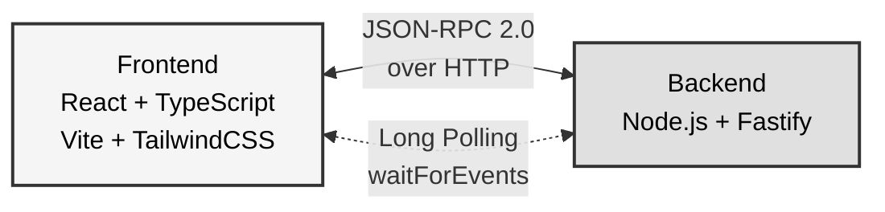
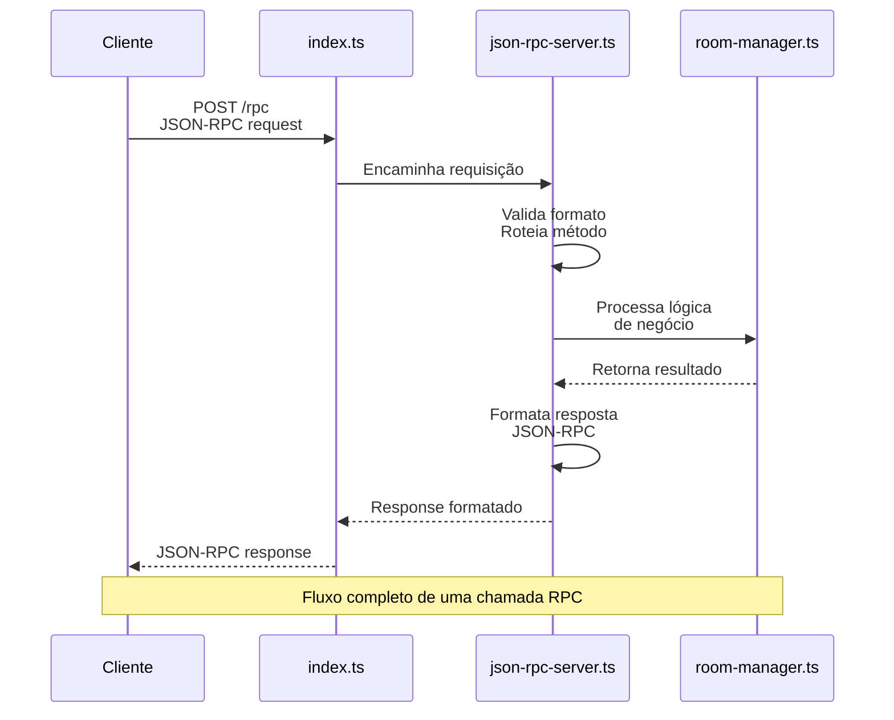
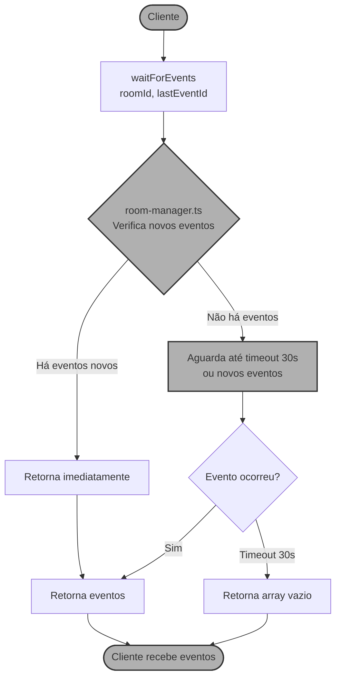
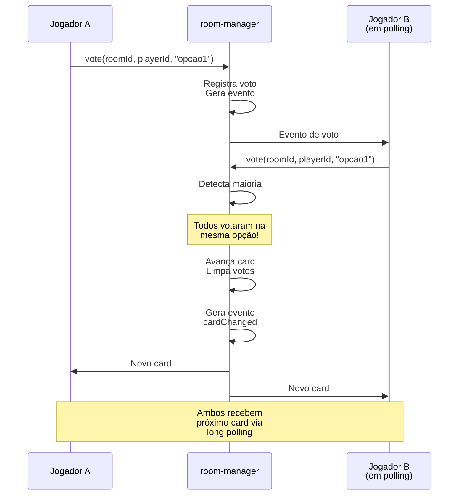
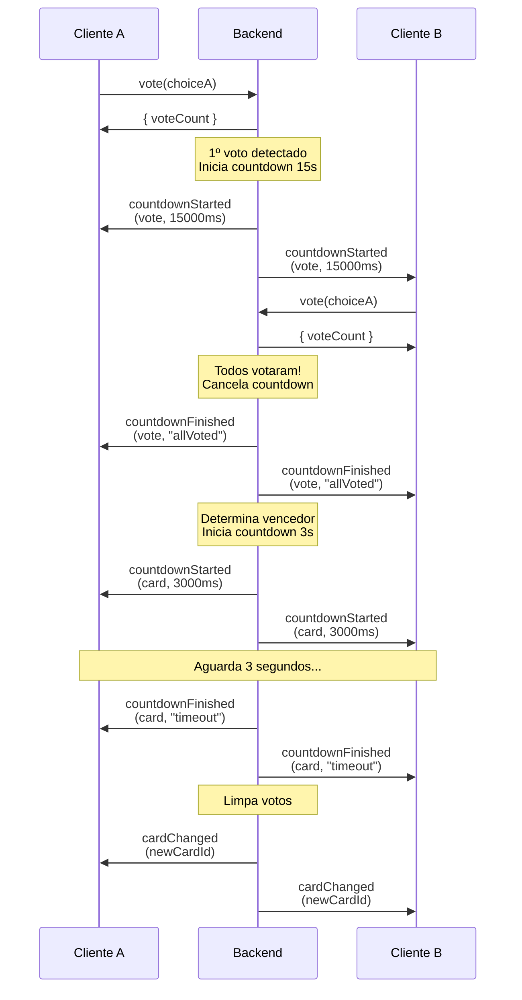
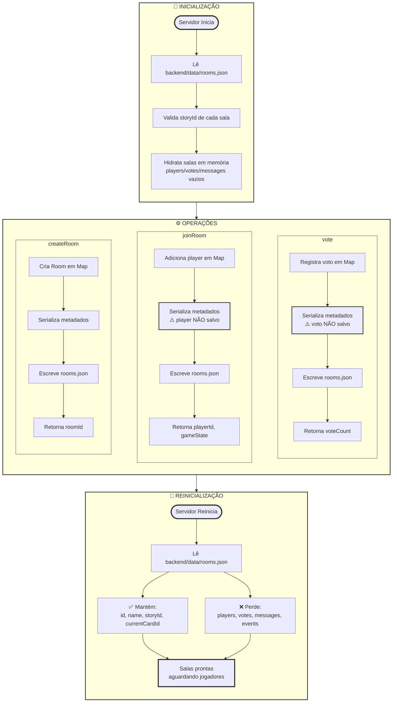

# 5. Arquitetura do Sistema

## 5.1 Visão Geral

O sistema segue uma arquitetura cliente-servidor simples com comunicação via JSON-RPC 2.0 sobre HTTP. Todos os dados são mantidos em memória no servidor.



## 5.2 Componentes do Backend

### 5.2.1 Estrutura de Módulos

```
backend/
├── src/
│   ├── index.ts              # Entry point, servidor Fastify
│   ├── json-rpc-server.ts    # Dispatcher JSON-RPC
│   ├── room-manager.ts       # Lógica de salas e gameplay
│   ├── story-manager.ts      # Carregamento de histórias
│   ├── types.ts              # Tipos e schemas Zod
│   └── logger.ts             # Logger Pino
├── stories/                  # Histórias em JSON
│   ├── caverna-misteriosa.json
│   ├── navio-pirata.json
│   └── reino-perdido.json
└── package.json
```

### 5.2.2 Camadas da Aplicação

#### Camada de Transporte (index.ts)
- **Responsabilidades**:
  - Inicializar servidor Fastify
  - Configurar CORS
  - Registrar endpoints (POST /rpc, GET /health)
  - Delegar requisições RPC para json-rpc-server

#### Camada RPC (json-rpc-server.ts)
- **Responsabilidades**:
  - Parsear requisições JSON-RPC 2.0
  - Validar formato (jsonrpc, method, id)
  - Rotear métodos para handlers apropriados
  - Formatar respostas JSON-RPC
  - Tratar erros e retornar códigos padronizados

#### Camada de Negócio (room-manager.ts, story-manager.ts)
- **Responsabilidades**:
  - **room-manager.ts**:
    - Gerenciar Map de salas em memória
    - Implementar lógica de votação
    - Gerar e armazenar eventos
    - Implementar long polling com waitForEvents
    - Controlar votação para deletar salas
  - **story-manager.ts**:
    - Carregar histórias da pasta stories/
    - Validar estrutura com Zod
    - Fornecer acesso às histórias

#### Camada de Dados (types.ts)
- **Responsabilidades**:
  - Definir schemas Zod para validação
  - Inferir tipos TypeScript dos schemas
  - Definir interfaces de dados (Player, Room, etc)

## 5.3 Fluxo de Dados

### 5.3.1 Requisição RPC Típica



### 5.3.2 Long Polling (waitForEvents)



### 5.3.3 Sistema de Votação



## 5.4 Armazenamento em Memória

### 5.4.1 Estrutura de Dados Principal

```typescript
// room-manager.ts
const rooms = new Map<string, Room>();

interface Room {
  id: string;
  name: string;
  storyId: string;
  currentCardId: string;
  players: Map<string, Player>;      // playerId → Player
  votes: Map<string, Vote>;          // playerId → Vote
  messages: ChatMessage[];           // Array de mensagens
  events: GameEvent[];               // Array de eventos
  eventIdCounter: number;            // Contador incremental
  deleteRoomVotes?: Map<string, DeleteRoomVote>;
  deleteRoomInitiatedAt?: number;
}
```

### 5.4.2 Características

- **Persistência Parcial**: Metadados de salas persistidos em arquivo JSON local
  - **Persistido**: `id`, `name`, `storyId`, `currentCardId`, `createdAt`
  - **Volátil**: `players`, `votes`, `messages`, `events`, `deleteRoomVotes`
  - **Arquivo**: `backend/data/rooms.json`
  - **Processo**: Salvo automaticamente após cada operação de modificação de sala
  - **Carregamento**: Automático na inicialização do servidor
  - **Validação**: Salas com `storyId` inválido são ignoradas ao carregar

- **Simplicidade**: Não requer banco de dados externo (apenas arquivo JSON local)

- **Performance**: Acesso ultra-rápido em memória (O(1) para Maps)

- **Limitação**: Não escalável horizontalmente (arquivo local único)

**Implementação** (`room-manager.ts`):
```typescript
private roomsFilePath = 'backend/data/rooms.json';

// Persistência automática
private persistRooms(): void;       // Salva após mudanças
private loadRoomsFromStorage(): void;  // Carrega na inicialização
private serializeRoom(room: Room): PersistedRoom;  // Serializa metadados
private hydrateRoom(persisted: PersistedRoom): Room;  // Reconstrói sala
```

## 5.5 Componentes do Frontend

### 5.5.1 Estrutura React + TypeScript

```
frontend/
├── src/
│   ├── main.tsx                    # Entry point React
│   ├── App.tsx                     # Componente raiz
│   ├── index.css                   # Estilos globais + TailwindCSS
│   ├── types.ts                    # Tipos compartilhados
│   ├── lib/
│   │   ├── rpc-client.ts           # Cliente JSON-RPC
│   │   └── utils.ts                # Utilitários (cn, clsx)
│   └── components/
│       ├── LoginScreen.tsx         # Tela de login (entrada de nome)
│       ├── LobbyScreen.tsx         # Lobby (listar/criar salas)
│       ├── GameScreen.tsx          # Tela de jogo principal
│       ├── ServerStatus.tsx        # Indicador de status do servidor
│       └── ui/                     # Componentes shadcn/ui
│           ├── button.tsx
│           ├── input.tsx
│           ├── card.tsx
│           ├── dialog.tsx
│           └── badge.tsx
├── public/
│   └── index.html                  # HTML base (SPA)
├── vite.config.ts                  # Configuração Vite
├── tailwind.config.js              # Configuração TailwindCSS
├── tsconfig.json                   # Configuração TypeScript
└── package.json
```

### 5.5.2 Cliente JSON-RPC (TypeScript)

```typescript
// lib/rpc-client.ts
export class JsonRpcClient {
  private url: string;
  private requestId = 0;

  constructor(url: string) {
    this.url = url;
  }

  async call<T = any>(method: string, params?: any): Promise<T> {
    const response = await fetch(this.url, {
      method: 'POST',
      headers: { 'Content-Type': 'application/json' },
      body: JSON.stringify({
        jsonrpc: '2.0',
        method,
        params,
        id: ++this.requestId
      })
    });

    const data = await response.json();
    if (data.error) {
      throw new Error(data.error.message);
    }
    return data.result;
  }
}

// Instância global
export const rpcClient = new JsonRpcClient('http://localhost:3000/rpc');
```

### 5.5.3 Long Polling Loop (React Hook)

```typescript
// Hook customizado para polling de eventos
function useRoomEvents(roomId: string | null) {
  const [events, setEvents] = useState<GameEvent[]>([]);
  const [lastEventId, setLastEventId] = useState(0);

  useEffect(() => {
    if (!roomId) return;

    let active = true;

    async function poll() {
      while (active) {
        try {
          const result = await rpcClient.call('waitForEvents', {
            roomId,
            lastEventId
          });

          if (active) {
            setEvents(prev => [...prev, ...result.events]);
            setLastEventId(result.lastEventId);
          }
        } catch (error) {
          console.error('Polling error:', error);
          await new Promise(resolve => setTimeout(resolve, 5000));
        }
      }
    }

    poll();

    return () => {
      active = false;
    };
  }, [roomId, lastEventId]);

  return events;
}
```

### 5.5.4 Sistema de Animações CSS

O frontend utiliza animações customizadas do TailwindCSS para melhorar a experiência do usuário.

**Classes de Animação** (`index.css`):
```css
@layer utilities {
  .animate-fade-in {
    animation: fadeIn 0.3s ease-in;
  }

  .animate-slide-in-left {
    animation: slideInLeft 0.4s ease-out;
  }

  .animate-slide-in-right {
    animation: slideInRight 0.4s ease-out;
  }

  .animate-pop-in {
    animation: popIn 0.3s cubic-bezier(0.68, -0.55, 0.265, 1.55);
  }
}

@keyframes fadeIn {
  from { opacity: 0; }
  to { opacity: 1; }
}

@keyframes slideInLeft {
  from { transform: translateX(-20px); opacity: 0; }
  to { transform: translateX(0); opacity: 1; }
}

@keyframes slideInRight {
  from { transform: translateX(20px); opacity: 0; }
  to { transform: translateX(0); opacity: 1; }
}

@keyframes popIn {
  0% { transform: scale(0.8); opacity: 0; }
  100% { transform: scale(1); opacity: 1; }
}
```

**Uso nos Componentes**:
- **Transições de tela**: `animate-fade-in` em LoginScreen, LobbyScreen, GameScreen
- **Entrada de cards/salas**: `animate-slide-in-left` e `animate-slide-in-right`
- **Botões e escolhas**: `animate-pop-in` para feedback de interação
- **Status de conexão**: `animate-pulse` (nativa Tailwind) no ServerStatus

**Justificativa**: Feedback visual suave melhora percepção de responsividade e qualidade da UI.

## 5.6 Protocolo JSON-RPC 2.0

### 5.6.1 Request Format

```json
{
  "jsonrpc": "2.0",
  "method": "createRoom",
  "params": {
    "name": "Minha Sala",
    "storyId": "caverna-misteriosa"
  },
  "id": 1
}
```

### 5.6.2 Success Response

```json
{
  "jsonrpc": "2.0",
  "result": {
    "roomId": "abc123xyz"
  },
  "id": 1
}
```

### 5.6.3 Error Response

```json
{
  "jsonrpc": "2.0",
  "error": {
    "code": -32001,
    "message": "Room not found",
    "data": { "roomId": "invalid-id" }
  },
  "id": 1
}
```

## 5.7 Diagramas de Sequência

### 5.7.1 Fluxo de Votação com Countdowns



### 5.7.2 Fluxo de Persistência



**Observação**: A persistência parcial permite que salas sobrevivam reinicializações, mas os jogadores precisam reentrar e o progresso de votação é perdido.

## 5.8 Padrões de Design

### 5.8.1 Singleton para Managers
- `room-manager.ts` e `story-manager.ts` exportam instâncias únicas
- Garante estado global consistente

### 5.8.2 Validação com Zod
- Todos inputs validados antes de processamento
- Tipos TypeScript inferidos dos schemas
- Erros de validação convertidos para JSON-RPC -32602

### 5.8.3 Event Sourcing Simplificado
- Eventos armazenados em array cronológico
- IDs incrementais permitem busca eficiente
- Clientes consultam apenas eventos novos

### 5.8.4 Long Polling Pattern
- Timeout de 30s evita bloqueio infinito
- Cliente reconecta automaticamente
- Garante eventual consistency

## 5.9 Limitações Arquiteturais

### Atuais
1. **Persistência parcial**: Apenas metadados de salas são salvos
   - Players, votos e mensagens são voláteis
   - Jogadores precisam reentrar após reinicialização do servidor
2. **Single instance**: Não pode escalar horizontalmente
   - Arquivo JSON local não permite múltiplas instâncias
3. **Memória limitada**: Cleanup automático básico
   - Limita últimos 100 eventos por sala
   - Retorna últimas 50 mensagens em `getGameState`
4. **Sem autenticação**: Qualquer um pode criar salas e entrar
5. **Sem rate limiting**: Vulnerável a abuso de requisições

---

[← Anterior: Requisitos Não Funcionais](./04-requisitos-nao-funcionais.md) | [Voltar ao Menu](./README.md) | [Próximo: APIs RPC →](./06-apis-rpc.md) 
