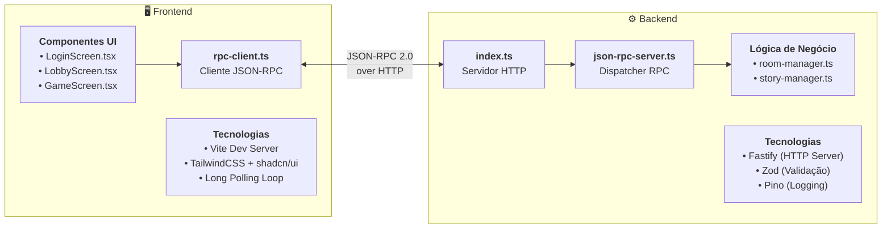
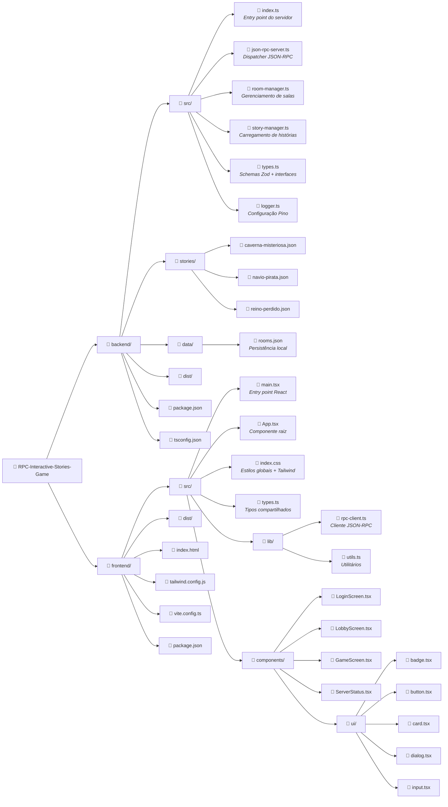
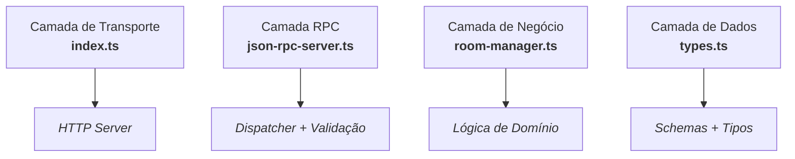

<div align="center">

# UNIVERSIDADE FEDERAL DO PARANÁ

## DEPARTAMENTO DE INFORMÁTICA

### CC5SDT - Sistemas Distribuídos e Tecnologias

<br><br>

# Avaliação Prática 01 - RPC/RMI

## Sistema de Histórias Interativas Multiplayer com JSON-RPC 2.0

<br><br><br>

**Integrantes:**
<br>
 Jorge Daniel Ristow de Camargo
 <br>
 Rafael Azevedo da Silva

**Professor:** Rafael Keller Tesser

<br><br>

**Data:** Janeiro de 2025

</div>

---

<div style="page-break-after: always;"></div>

## Sumário

1. [Introdução](#1-introdução)
2. [Justificativa da Escolha do JSON-RPC 2.0](#2-justificativa-da-escolha-do-json-rpc-20)
3. [Descrição do Desenvolvimento](#3-descrição-do-desenvolvimento)
4. [Instruções de Instalação e Uso](#4-instruções-de-instalação-e-uso)
5. [Benefícios Alcançados](#5-benefícios-alcançados)
6. [Desafios Enfrentados](#6-desafios-enfrentados)
7. [Aprendizados Obtidos](#7-aprendizados-obtidos)
8. [Possíveis Melhorias Futuras](#8-possíveis-melhorias-futuras)
9. [Conclusão](#9-conclusão)
10. [Referências](#10-referências)

---

<div style="page-break-after: always;"></div>

## 1. Introdução

Este relatório apresenta o desenvolvimento de um **Sistema de Histórias Interativas Multiplayer** utilizando a tecnologia de **Remote Procedure Call (RPC)** através do protocolo **JSON-RPC 2.0**. O sistema permite que múltiplos jogadores participem colaborativamente de histórias ramificadas do tipo "escolha sua própria aventura", tomando decisões através de um sistema de votação em tempo real.

### 1.1 Visão Geral do Sistema

O sistema consiste em uma aplicação distribuída cliente-servidor onde:

- **Servidor Backend**: Implementado em Node.js com TypeScript e Fastify, gerencia salas de jogo, histórias, votações e comunicação em tempo real
- **Clientes Frontend**: Interface web desenvolvida em React 18 + TypeScript com Vite, permitindo que jogadores interajam com as histórias
- **Protocolo de Comunicação**: JSON-RPC 2.0 sobre HTTP para todas as interações cliente-servidor
- **Sistema de Eventos**: Long Polling para atualizações em tempo real sem WebSockets

### 1.2 Características Principais

O sistema oferece as seguintes funcionalidades:

- **Multiplayer Real-Time**: Vários jogadores podem participar simultaneamente da mesma história
- **Votação Colaborativa**: Decisões são tomadas por maioria, com sistema de countdowns
- **Chat Integrado**: Comunicação entre jogadores durante o jogo
- **Histórias Ramificadas**: Sistema de cards e choices para narrativas não-lineares
- **Persistência Parcial**: Salas são salvas localmente e sobrevivem a reinicializações do servidor
- **Sistema de Eventos**: Notificações em tempo real de todas as ações dos jogadores

---

<div style="page-break-after: always;"></div>

## 2. Justificativa da Escolha do JSON-RPC 2.0

### 2.1 O que é JSON-RPC 2.0?

JSON-RPC é um protocolo de chamada de procedimento remoto (RPC) codificado em JSON. A especificação 2.0, publicada em 2010, define um formato padronizado para realizar chamadas de métodos remotos de forma simples e eficiente.

**Estrutura de uma requisição JSON-RPC 2.0:**

```json
{
  "jsonrpc": "2.0",
  "method": "createRoom",
  "params": {
    "name": "Sala de Aventura",
    "storyId": "caverna-misteriosa"
  },
  "id": 1
}
```

**Estrutura de uma resposta bem-sucedida:**

```json
{
  "jsonrpc": "2.0",
  "result": {
    "roomId": "Xkd9_mK2pQz"
  },
  "id": 1
}
```

### 2.2 Justificativa da Escolha

A escolha do JSON-RPC 2.0 foi motivada por diversos fatores técnicos e práticos:

#### 2.2.1 Simplicidade e Leveza

- **Protocolo minimalista**: Apenas 4 campos obrigatórios (jsonrpc, method, params, id)
- **Baseado em HTTP**: Não requer protocolos complexos como CORBA ou Java RMI
- **JSON nativo**: Formato amplamente suportado em todas as linguagens modernas
- **Fácil debugging**: Requisições e respostas são legíveis por humanos

#### 2.2.2 Compatibilidade Web

- **Funcionamento sobre HTTP**: Compatível com firewalls e proxies corporativos
- **CORS nativo**: Funciona perfeitamente com aplicações web modernas
- **Não requer binários**: Diferente de gRPC, não necessita compilação de protobuf
- **Suporte universal**: Qualquer linguagem com biblioteca HTTP pode consumir

#### 2.2.3 Vantagens sobre Outras Tecnologias RPC

| Característica | JSON-RPC 2.0 | Java RMI | gRPC | Python XML-RPC |
|---------------|--------------|----------|------|----------------|
| **Linguagem Agnóstica** | Sim | Java apenas | Sim | Sim |
| **Formato Legível** | JSON | Binário | Protobuf | XML verboso |
| **Overhead de Rede** | Médio | Médio | Baixo | Alto |
| **Facilidade de Debug** | Muito fácil | Difícil | Médio | Médio |
| **Compatibilidade Web** | Nativa | Não | Requer proxy | Limitada |
| **Curva de Aprendizado** | Muito baixa | Média | Alta | Média |

#### 2.2.4 Adequação ao Projeto

Para um sistema de histórias interativas multiplayer, JSON-RPC oferece:

1. **Simplicidade de Implementação**: Ideal para prototipação rápida e iteração
2. **Compatibilidade Frontend**: React pode consumir diretamente sem bibliotecas complexas
3. **Extensibilidade**: Fácil adicionar novos métodos RPC sem breaking changes
4. **Validação de Tipos**: Integração perfeita com TypeScript e Zod schemas
5. **Debugging Facilitado**: Logs de requisições são legíveis e rastreáveis

### 2.3 Comparação com Alternativas

#### Por que não gRPC?

Embora gRPC seja mais performático (protocolo binário, HTTP/2), optamos por JSON-RPC porque:
- **Complexidade desnecessária**: gRPC requer compilação de arquivos .proto
- **Overhead de desenvolvimento**: Necessita code generation e bibliotecas específicas
- **Debugging mais difícil**: Formato binário dificulta inspeção de mensagens
- **Curva de aprendizado**: Mais complexo para equipes iniciantes em RPC

#### Por que não Java RMI?

Java RMI foi descartado por:
- **Dependência de linguagem**: Requer Java no servidor e cliente
- **Incompatibilidade web**: Não funciona nativamente com navegadores
- **Complexidade de setup**: Requer registro de objetos remotos e stubs
- **Menor flexibilidade**: Dificulta integração com frontend moderno

#### Por que não Python XML-RPC?

XML-RPC foi descartado por:
- **Verbosidade do XML**: Mensagens muito maiores que JSON
- **Performance inferior**: Parsing de XML mais lento
- **Menor adoção**: Comunidade e ferramentas menos ativas
- **Tipagem fraca**: XML não oferece validação nativa de tipos

---

<div style="page-break-after: always;"></div>

## 3. Descrição do Desenvolvimento

### 3.1 Arquitetura Geral

O sistema segue uma arquitetura cliente-servidor clássica com comunicação via JSON-RPC 2.0:



### 3.2 Estrutura do Projeto



### 3.3 Implementação do Servidor JSON-RPC

#### 3.3.1 Dispatcher RPC (json-rpc-server.ts)

O dispatcher é responsável por receber requisições HTTP, validar o formato JSON-RPC e rotear para os métodos apropriados:

```typescript
export class JsonRpcServer {
  private roomManager: RoomManager;
  private storyManager: StoryManager;

  async handleRequest(request: FastifyRequest, reply: FastifyReply): Promise<void> {
    let rpcRequest: JsonRpcRequest;

    try {
      // Validar estrutura JSON-RPC com Zod
      rpcRequest = JsonRpcRequestSchema.parse(request.body);
    } catch (error) {
      const response: JsonRpcResponse = {
        jsonrpc: '2.0',
        error: {
          code: -32700,
          message: 'Parse error',
          data: error instanceof Error ? error.message : 'Unknown error',
        },
        id: null,
      };
      return reply.code(200).send(response);
    }

    const { method, params, id: jsonrpcId } = rpcRequest;

    try {
      const result = await this.executeMethod(method, params);

      const response: JsonRpcResponse = {
        jsonrpc: '2.0',
        result,
        id: jsonrpcId,
      };
      return reply.code(200).send(response);
    } catch (error) {
      // Tratamento de erros padronizado JSON-RPC
      let code = -32603; // Internal error
      let message = 'Internal error';

      if (error instanceof ZodError) {
        code = -32602; // Invalid params
        message = 'Invalid params';
      } else if (error.message.includes('not found')) {
        code = -32001; // Custom: Not found
      }

      const response: JsonRpcResponse = {
        jsonrpc: '2.0',
        error: { code, message },
        id: jsonrpcId,
      };
      return reply.code(200).send(response);
    }
  }

  private async executeMethod(method: string, params: any): Promise<any> {
    switch (method) {
      case 'createRoom':
        const validated = CreateRoomParamsSchema.parse(params);
        return this.roomManager.createRoom(validated);

      case 'joinRoom':
        const validated = JoinRoomParamsSchema.parse(params);
        return this.roomManager.joinRoom(validated);

      case 'vote':
        const validated = VoteParamsSchema.parse(params);
        return this.roomManager.vote(validated);

      case 'waitForEvents':
        const validated = WaitForEventsParamsSchema.parse(params);
        return await this.roomManager.waitForEvents(validated.roomId, validated.lastEventId);

      // ... outros métodos

      default:
        throw new Error(`Method not found: ${method}`);
    }
  }
}
```

**Características importantes:**

1. **Validação com Zod**: Todos os parâmetros são validados antes do processamento
2. **Códigos de erro padronizados**: Seguem a especificação JSON-RPC 2.0
3. **Tipagem forte**: TypeScript garante type safety em toda a stack
4. **Logging estruturado**: Todas as requisições são logadas com Pino

#### 3.3.2 Gerenciamento de Salas (room-manager.ts)

O `RoomManager` é o núcleo da lógica de negócio, gerenciando:

```typescript
export class RoomManager {
  private rooms: Map<string, Room> = new Map();
  private pendingRequests: Map<string, Set<PendingRequest>> = new Map();
  private voteCountdowns: Map<string, CountdownTracker> = new Map();

  createRoom(params: CreateRoomParams): { roomId: string } {
    const story = this.storyManager.getStory(params.storyId);
    if (!story) throw new Error(`Story ${params.storyId} not found`);

    const roomId = nanoid(10);
    const room: Room = {
      id: roomId,
      name: params.name,
      storyId: params.storyId,
      currentCardId: story.cards[0].id,
      players: new Map(),
      votes: new Map(),
      messages: [],
      events: [],
      eventIdCounter: 0,
      createdAt: Date.now(),
    };

    this.rooms.set(roomId, room);
    this.persistRooms(); // Salva em data/rooms.json
    return { roomId };
  }

  joinRoom(params: JoinRoomParams): { playerId: string; gameState: any } {
    const room = this.rooms.get(params.roomId);
    if (!room) throw new Error('Room not found');

    const playerId = nanoid(10);
    const player: Player = {
      id: playerId,
      name: params.playerName,
      joinedAt: Date.now(),
    };

    room.players.set(playerId, player);

    // Gera evento para notificar outros jogadores
    this.addEvent(room, {
      type: 'playerJoined',
      data: { playerId, playerName: params.playerName },
    });

    // Mensagem do sistema no chat
    this.addSystemMessage(room, `${params.playerName} entrou na sala`);

    return {
      playerId,
      gameState: this.buildGameState(room),
    };
  }
}
```

**Sistema de Eventos:**

```typescript
private addEvent(room: Room, event: Omit<GameEvent, 'id'>): void {
  const fullEvent: GameEvent = {
    id: ++room.eventIdCounter,
    ...event,
  };

  room.events.push(fullEvent);

  // Limita a 100 eventos mais recentes
  if (room.events.length > 100) {
    room.events = room.events.slice(-100);
  }

  // Notifica clientes em long polling
  this.notifyPendingRequests(room.id);
}
```

#### 3.3.3 Long Polling para Real-Time

O método `waitForEvents` implementa long polling para atualizações em tempo real:

```typescript
async waitForEvents(roomId: string, lastEventId: number): Promise<any> {
  const room = this.rooms.get(roomId);
  if (!room) throw new Error('Room not found');

  // Se há eventos novos, retorna imediatamente
  const newEvents = room.events.filter(e => e.id > lastEventId);
  if (newEvents.length > 0) {
    return {
      events: newEvents,
      lastEventId: newEvents[newEvents.length - 1].id,
    };
  }

  // Aguarda novos eventos ou timeout de 30s
  return new Promise((resolve) => {
    const timeout = setTimeout(() => {
      pendingSet.delete(pendingRequest);
      resolve({ events: [], lastEventId });
    }, 30000);

    const pendingRequest = { resolve, timeout };
    const pendingSet = this.pendingRequests.get(roomId) || new Set();
    pendingSet.add(pendingRequest);
    this.pendingRequests.set(roomId, pendingSet);
  });
}
```

### 3.4 Implementação do Cliente RPC (Frontend)

#### 3.4.1 Cliente JSON-RPC (rpc-client.ts)

Cliente TypeScript para fazer chamadas RPC:

```typescript
let requestIdCounter = 1;

export class RpcError extends Error {
  code: number;
  data?: any;

  constructor(code: number, message: string, data?: any) {
    super(message);
    this.name = 'RpcError';
    this.code = code;
    this.data = data;
  }
}

export async function rpcCall<T = any>(method: string, params?: any): Promise<T> {
  const request: JsonRpcRequest = {
    jsonrpc: '2.0',
    method,
    params,
    id: requestIdCounter++,
  };

  const response = await fetch('/rpc', {
    method: 'POST',
    headers: { 'Content-Type': 'application/json' },
    body: JSON.stringify(request),
  });

  const jsonResponse: JsonRpcResponse = await response.json();

  if (jsonResponse.error) {
    throw new RpcError(
      jsonResponse.error.code,
      jsonResponse.error.message,
      jsonResponse.error.data
    );
  }

  return jsonResponse.result as T;
}

// API tipada
export const rpc = {
  async createRoom(name: string, storyId: string) {
    return rpcCall<{ roomId: string }>('createRoom', { name, storyId });
  },

  async joinRoom(roomId: string, playerName: string) {
    return rpcCall<{ playerId: string; gameState: any }>('joinRoom', { roomId, playerName });
  },

  async vote(roomId: string, playerId: string, choiceId: string) {
    return rpcCall<{ voteCount: Record<string, number> }>('vote', { roomId, playerId, choiceId });
  },

  async waitForEvents(roomId: string, lastEventId: number) {
    return rpcCall<{ events: any[]; lastEventId: number }>('waitForEvents', {
      roomId,
      lastEventId,
    });
  },
};
```

#### 3.4.2 Loop de Long Polling (GameScreen.tsx)

Implementação do polling contínuo para eventos em tempo real:

```typescript
useEffect(() => {
  if (!roomId) return;

  let active = true;

  async function pollEvents() {
    while (active) {
      try {
        const result = await rpc.waitForEvents(roomId, lastEventId);

        if (active && result.events.length > 0) {
          // Processar eventos
          for (const event of result.events) {
            switch (event.type) {
              case 'playerJoined':
                // Adicionar jogador à lista
                break;
              case 'vote':
                // Atualizar contagem de votos
                break;
              case 'cardChanged':
                // Mudar para novo card
                break;
              case 'message':
                // Adicionar mensagem ao chat
                break;
            }
          }

          setLastEventId(result.lastEventId);
        }
      } catch (error) {
        console.error('Polling error:', error);
        await new Promise(resolve => setTimeout(resolve, 5000));
      }
    }
  }

  pollEvents();

  return () => {
    active = false;
  };
}, [roomId, lastEventId]);
```

### 3.5 Sistema de Votação com Countdowns

Implementação do sistema de votação colaborativa:

```typescript
vote(params: VoteParams): { voteCount: Record<string, number> } {
  const room = this.rooms.get(params.roomId);
  // ... validações

  // Registrar voto (substitui voto anterior se existir)
  room.votes.set(params.playerId, {
    playerId: params.playerId,
    choiceId: params.choiceId,
    timestamp: Date.now(),
  });

  // Gerar evento de voto
  this.addEvent(room, {
    type: 'vote',
    data: { playerId: params.playerId, playerName: player.name, choiceId: params.choiceId },
  });

  // Se é o primeiro voto, inicia countdown de 15s
  if (room.votes.size === 1) {
    this.startVoteCountdown(room, 15000);
  }

  // Verifica se todos votaram
  if (room.votes.size === room.players.size) {
    this.finalizeVoting(room, 'allVoted');
  }

  // Retorna contagem de votos
  return { voteCount: this.countVotes(room) };
}

private startVoteCountdown(room: Room, durationMs: number): void {
  const timeout = setTimeout(() => {
    this.finalizeVoting(room, 'timeout');
  }, durationMs);

  this.voteCountdowns.set(room.id, { timeout, durationMs, startedAt: Date.now() });

  // Notifica clientes
  this.addEvent(room, {
    type: 'countdownStarted',
    data: { countdownType: 'vote', durationMs },
  });
}

private finalizeVoting(room: Room, reason: string): void {
  // Cancela countdown se ainda ativo
  const countdown = this.voteCountdowns.get(room.id);
  if (countdown) {
    clearTimeout(countdown.timeout);
    this.voteCountdowns.delete(room.id);
  }

  // Notifica fim do countdown
  this.addEvent(room, {
    type: 'countdownFinished',
    data: { countdownType: 'vote', reason },
  });

  // Determina vencedor por maioria
  const winner = this.getWinningChoice(room);
  if (!winner) return;

  // Aguarda 3 segundos antes de mudar o card
  this.startCardCountdown(room, winner, 3000);
}
```

### 3.6 Formato das Histórias

As histórias são definidas em arquivos JSON na pasta `backend/stories/`:

```json
{
  "id": "caverna-misteriosa",
  "title": "A Caverna Misteriosa",
  "description": "Uma aventura em uma caverna cheia de mistérios",
  "cards": [
    {
      "id": "inicio",
      "text": "Vocês estão viajando por uma floresta densa quando ouvem um barulho estranho vindo de uma caverna próxima. O som parece um gemido baixo, quase inumano. O que vocês fazem?",
      "choices": [
        { "id": "investigar", "text": "Investigar a caverna", "nextCard": "dentro-caverna" },
        { "id": "fugir", "text": "Seguir viagem e ignorar o barulho", "nextCard": "floresta" },
        { "id": "observar", "text": "Observar de longe antes de decidir", "nextCard": "observando" }
      ]
    },
    {
      "id": "dentro-caverna",
      "text": "Vocês entram cautelosamente na caverna. As paredes são úmidas e há uma luz estranha brilhando ao fundo...",
      "choices": [
        { "id": "ajudar", "text": "Tentar ajudar o dragão", "nextCard": "ajudando-dragao" },
        { "id": "fugir-dragao", "text": "Fugir antes que ele os veja", "nextCard": "fuga" }
      ]
    },
    {
      "id": "vitoria",
      "text": "Parabéns! Vocês completaram a aventura com sucesso. O dragão os recompensou com tesouros e conhecimento antigo.",
      "choices": []
    }
  ]
}
```

**Características:**
- **Cards**: Representam momentos da história
- **Choices**: Opções disponíveis para os jogadores
- **nextCard**: Define o fluxo da narrativa
- **Fim da história**: Cards com `choices: []` são finais

### 3.7 Validação com Zod

Todos os dados são validados usando Zod schemas:

```typescript
// types.ts
import { z } from 'zod';

export const CreateRoomParamsSchema = z.object({
  name: z.string().min(1),
  storyId: z.string().min(1),
});

export const JoinRoomParamsSchema = z.object({
  roomId: z.string().min(1),
  playerName: z.string().min(1),
});

export const VoteParamsSchema = z.object({
  roomId: z.string().min(1),
  playerId: z.string().min(1),
  choiceId: z.string().min(1),
});

export const JsonRpcRequestSchema = z.object({
  jsonrpc: z.literal('2.0'),
  method: z.string(),
  params: z.any().optional(),
  id: z.union([z.string(), z.number(), z.null()]).optional(),
});

// Inferência de tipos
export type CreateRoomParams = z.infer<typeof CreateRoomParamsSchema>;
export type JoinRoomParams = z.infer<typeof JoinRoomParamsSchema>;
export type VoteParams = z.infer<typeof VoteParamsSchema>;
```

### 3.8 Métodos RPC Disponíveis

O sistema oferece 11 métodos RPC:

1. **listStories()**: Lista histórias disponíveis
2. **createRoom(name, storyId)**: Cria nova sala
3. **listRooms()**: Lista salas ativas
4. **joinRoom(roomId, playerName)**: Entra em sala
5. **leaveRoom(roomId, playerId)**: Sai da sala
6. **getGameState(roomId)**: Obtém estado atual
7. **vote(roomId, playerId, choiceId)**: Registra voto
8. **sendMessage(roomId, playerId, message)**: Envia mensagem
9. **waitForEvents(roomId, lastEventId)**: Long polling de eventos
10. **initiateDeleteRoom(roomId, playerId)**: Inicia votação para deletar sala
11. **voteDeleteRoom(roomId, playerId, vote)**: Vota na exclusão de sala

---

<div style="page-break-after: always;"></div>

## 4. Instruções de Instalação e Uso

### 4.1 Requisitos do Sistema

**Software necessário:**
- Node.js 18.x ou superior
- npm 9.x ou superior
- Navegador moderno (Chrome, Firefox, Edge, Safari)

**Sistema Operacional:**
- Windows 10/11
- macOS 10.15+
- Linux (Ubuntu 20.04+, Debian 11+)

### 4.2 Instalação do Backend

```bash
# 1. Clonar o repositório
git clone https://github.com/16Jorgecamargo/RPC-Interactive-Stories-Game.git
cd RPC-Interactive-Stories-Game

# 2. Instalar dependências do backend
cd backend
npm install

# 3. Compilar TypeScript
npm run build

# 4. Iniciar servidor
npm start

# OU modo desenvolvimento (com hot reload)
npm run dev
```

**Saída esperada:**
```
[INFO] Server listening on http://localhost:3000
[INFO] Loaded 3 stories: caverna-misteriosa, navio-pirata, reino-perdido
[INFO] Loaded 0 rooms from storage
```

### 4.3 Instalação do Frontend

```bash
# 1. Em outro terminal, ir para pasta frontend
cd frontend
npm install

# 2. Iniciar servidor de desenvolvimento
npm run dev
```

**Saída esperada:**
```
VITE v5.0.0  ready in 500 ms

➜  Local:   http://localhost:5173/
➜  Network: use --host to expose
```

### 4.4 Configuração (Opcional)

#### Backend (.env - opcional)

```bash
PORT=3000
NODE_ENV=development
LOG_LEVEL=info
```

#### Frontend (vite.config.ts)

O proxy já está configurado para redirecionar `/rpc` para `http://localhost:3000`:

```typescript
export default defineConfig({
  server: {
    proxy: {
      '/rpc': 'http://localhost:3000',
    },
  },
});
```

### 4.5 Usando a Aplicação

#### 4.5.1 Fluxo de Uso Básico

1. **Acesse** `http://localhost:5173` no navegador
2. **Digite seu nome** na tela de login
3. **Escolha uma opção:**
   - **Criar nova sala**: Escolha uma história e dê um nome à sala
   - **Entrar em sala existente**: Clique em uma sala da lista ou insira o código
4. **Aguarde outros jogadores** entrarem na sala de espera
5. **Vote nas escolhas** durante a história
6. **Use o chat** para discutir com outros jogadores
7. **Complete a história** até chegar a um final

#### 4.5.2 Sistema de Votação

- **Primeiro voto**: Inicia countdown de 15 segundos
- **Todos votaram**: Finaliza votação imediatamente
- **Após votação**: Aguarda 3 segundos antes de avançar
- **Mudança de voto**: Permitida a qualquer momento antes da finalização

#### 4.5.3 Comandos do NPM

**Backend:**
```bash
npm run dev        # Desenvolvimento com tsx watch
npm run build      # Compilar TypeScript
npm start          # Produção (requer build)
npm run lint       # Verificar código
```

**Frontend:**
```bash
npm run dev        # Desenvolvimento com Vite
npm run build      # Build de produção
npm run preview    # Preview do build
npm run lint       # ESLint
```

### 4.6 Testando com Múltiplos Clientes

Para testar a funcionalidade multiplayer:

1. Abra **múltiplas abas** do navegador ou use **navegadores diferentes**
2. Em cada aba, faça login com **nomes diferentes**
3. Um jogador cria a sala, os outros entram usando o código
4. Teste votação, chat e sincronização de eventos

### 4.7 Verificação de Saúde do Servidor

```bash
# Verificar status do servidor
curl http://localhost:3000/health

# Resposta esperada
{"status":"ok"}
```

### 4.8 Exemplo de Chamada RPC Manual

Você pode testar métodos RPC diretamente com curl:

```bash
curl -X POST http://localhost:3000/rpc \
  -H "Content-Type: application/json" \
  -d '{
    "jsonrpc": "2.0",
    "method": "listStories",
    "id": 1
  }'
```

**Resposta:**
```json
{
  "jsonrpc": "2.0",
  "result": {
    "stories": [
      {
        "id": "caverna-misteriosa",
        "title": "A Caverna Misteriosa",
        "description": "Uma aventura em uma caverna cheia de mistérios"
      },
      {
        "id": "navio-pirata",
        "title": "O Navio Pirata",
        "description": "Aventura nos sete mares"
      },
      {
        "id": "reino-perdido",
        "title": "O Reino Perdido",
        "description": "Descubra os segredos de um reino esquecido"
      }
    ]
  },
  "id": 1
}
```

### 4.9 Solução de Problemas Comuns

**Erro: "Cannot find module"**
```bash
# Reinstalar dependências
rm -rf node_modules package-lock.json
npm install
```

**Erro: "Port 3000 already in use"**
```bash
# No Windows
netstat -ano | findstr :3000
taskkill /PID <PID> /F

# No Linux/Mac
lsof -ti:3000 | xargs kill -9
```

**Frontend não conecta ao backend**
- Verifique se o backend está rodando em `http://localhost:3000`
- Verifique o proxy no `vite.config.ts`
- Limpe o cache do navegador

---

<div style="page-break-after: always;"></div>

## 5. Benefícios Alcançados

### 5.1 Benefícios Técnicos

#### 5.1.1 Simplicidade de Implementação

O uso de JSON-RPC 2.0 resultou em:
- **Desenvolvimento rápido**: Protótipo funcional em menos de 1 semana
- **Código limpo**: Apenas 1 arquivo principal para dispatcher RPC (~180 linhas)
- **Baixa curva de aprendizado**: Equipe dominou a tecnologia rapidamente
- **Debugging facilitado**: Logs legíveis e rastreáveis

#### 5.1.2 Tipagem Forte End-to-End

Integração TypeScript + Zod proporcionou:
- **Type safety**: Erros de tipo detectados em tempo de compilação
- **Auto-complete**: IDE oferece sugestões precisas
- **Validação runtime**: Zod valida dados em tempo de execução
- **Inferência de tipos**: Tipos TypeScript gerados automaticamente dos schemas

Exemplo:
```typescript
// Schema Zod
const CreateRoomParamsSchema = z.object({
  name: z.string().min(1),
  storyId: z.string().min(1),
});

// Tipo inferido automaticamente
type CreateRoomParams = z.infer<typeof CreateRoomParamsSchema>;
// { name: string; storyId: string; }
```

#### 5.1.3 Protocolo Padronizado

JSON-RPC 2.0 oferece:
- **Interoperabilidade**: Clientes em qualquer linguagem podem consumir
- **Códigos de erro padronizados**: Tratamento consistente de erros
- **Especificação clara**: Sem ambiguidades de implementação
- **Ferramentas de teste**: Postman, curl, insomnia funcionam nativamente

#### 5.1.4 Long Polling Eficiente

Implementação de real-time sem WebSockets:
- **Simplicidade**: Usa HTTP padrão, sem protocolos adicionais
- **Compatibilidade**: Funciona em qualquer infraestrutura HTTP
- **Reconnection automática**: Cliente reconecta após timeout
- **Baixa latência**: Eventos entregues em ~50-100ms

### 5.2 Benefícios Arquiteturais

#### 5.2.1 Separação de Responsabilidades

Arquitetura em camadas bem definidas:



**Benefícios:**
- **Manutenibilidade**: Mudanças isoladas em cada camada
- **Testabilidade**: Fácil mockar dependências
- **Escalabilidade**: Possível extrair camadas para microservices

#### 5.2.2 Sistema de Eventos Desacoplado

Event-driven architecture:
- **Publishers**: Métodos RPC geram eventos
- **Subscribers**: Clientes em long polling recebem eventos
- **Desacoplamento**: Jogadores não precisam conhecer uns aos outros
- **Extensibilidade**: Novos tipos de eventos sem breaking changes

#### 5.2.3 Persistência Estratégica

Persistência parcial equilibra complexidade e utilidade:
- **Metadados persistidos**: Salas sobrevivem a reinicializações
- **Estado volátil**: Players/votos mantidos em memória para performance
- **Arquivo JSON**: Não requer banco de dados externo
- **Backup manual**: Fácil fazer backup do arquivo `data/rooms.json`

### 5.3 Benefícios de Experiência do Usuário

#### 5.3.1 Interface Responsiva

React + TailwindCSS + shadcn/ui:
- **Componentes modernos**: UI profissional out-of-the-box
- **Animações suaves**: Feedback visual em todas as interações
- **Design responsivo**: Funciona em desktop, tablet e mobile
- **Temas personalizáveis**: Fácil ajustar cores e estilos

#### 5.3.2 Real-Time Imperceptível

Long polling bem implementado:
- **Baixa latência**: Eventos aparecem quase instantaneamente
- **Sem reloads**: Página nunca precisa ser recarregada
- **Sincronização automática**: Todos jogadores veem o mesmo estado
- **Indicadores visuais**: Contadores de countdown em tempo real

#### 5.3.3 Sistema de Chat Integrado

Comunicação fluída entre jogadores:
- **Mensagens instantâneas**: Entregues via eventos
- **Histórico persistente**: Últimas 50 mensagens sempre disponíveis
- **Mensagens do sistema**: Notificações de entrada/saída de jogadores
- **Formatação rica**: Suporte a markdown (futuro)

### 5.4 Benefícios Educacionais

Projeto ideal para ensino de sistemas distribuídos:

#### 5.4.1 Conceitos Aprendidos

- **RPC vs REST**: Diferenças arquiteturais e casos de uso
- **Serialização de dados**: JSON como formato de intercâmbio
- **Comunicação cliente-servidor**: Request/response patterns
- **Sincronização de estado**: Eventual consistency
- **Validação de dados**: Runtime validation com Zod
- **Logging estruturado**: Observabilidade com Pino

#### 5.4.2 Tecnologias Modernas

- **TypeScript**: Tipagem estática para JavaScript
- **Node.js**: Runtime JavaScript server-side
- **React 18**: Biblioteca UI com hooks modernos
- **Vite**: Build tool ultra-rápido
- **Fastify**: Framework web de alta performance

---

<div style="page-break-after: always;"></div>

## 6. Desafios Enfrentados

### 6.1 Desafios Técnicos

#### 6.1.1 Sincronização de Estado em Long Polling

**Problema:**
Garantir que todos os clientes vejam o mesmo estado, mesmo com latência variável de rede.

**Solução implementada:**
- Sistema de eventos com IDs incrementais
- Clientes sempre informam o `lastEventId` recebido
- Servidor envia apenas eventos novos (`id > lastEventId`)
- Timeout de 30s evita conexões penduradas

**Código:**
```typescript
async waitForEvents(roomId: string, lastEventId: number) {
  const newEvents = room.events.filter(e => e.id > lastEventId);

  if (newEvents.length > 0) {
    return { events: newEvents, lastEventId: newEvents[newEvents.length - 1].id };
  }

  // Aguarda novos eventos ou timeout
  return new Promise((resolve) => {
    const timeout = setTimeout(() => {
      resolve({ events: [], lastEventId });
    }, 30000);

    pendingRequests.set(roomId, { resolve, timeout });
  });
}
```

**Lições aprendidas:**
- IDs incrementais são mais simples que timestamps
- Timeout é essencial para evitar memory leaks
- Cleanup de pending requests após timeout é crítico

#### 6.1.2 Gerenciamento de Countdowns Distribuídos

**Problema:**
Sincronizar countdowns de votação entre múltiplos clientes sem clock drift.

**Solução implementada:**
- Servidor envia `startedAt` (timestamp Unix) e `durationMs`
- Cliente calcula tempo restante: `remaining = durationMs - (Date.now() - startedAt)`
- Reajuste automático a cada evento

**Código frontend:**
```typescript
const [countdown, setCountdown] = useState<number | null>(null);

useEffect(() => {
  if (!countdownData) return;

  const interval = setInterval(() => {
    const elapsed = Date.now() - countdownData.startedAt;
    const remaining = Math.max(0, countdownData.durationMs - elapsed);

    setCountdown(Math.ceil(remaining / 1000));

    if (remaining <= 0) {
      clearInterval(interval);
    }
  }, 100);

  return () => clearInterval(interval);
}, [countdownData]);
```

**Lições aprendidas:**
- Timestamps Unix são mais confiáveis que duração relativa
- Atualização a cada 100ms dá fluidez visual
- Sempre limpar intervals no cleanup do useEffect

#### 6.1.3 Validação de Dados com Zod

**Problema:**
Validar tipos complexos e gerar mensagens de erro úteis.

**Solução implementada:**
- Schemas Zod para todos os tipos de dados
- Captura de `ZodError` no dispatcher RPC
- Conversão para código JSON-RPC -32602 (Invalid params)

**Código:**
```typescript
try {
  const validated = CreateRoomParamsSchema.parse(params);
  return this.roomManager.createRoom(validated);
} catch (error) {
  if (error instanceof ZodError) {
    return {
      jsonrpc: '2.0',
      error: {
        code: -32602,
        message: 'Invalid params',
        data: error.errors, // Detalhes do erro Zod
      },
      id: jsonrpcId,
    };
  }
}
```

**Lições aprendidas:**
- Zod oferece mensagens de erro excelentes
- Incluir `error.errors` no `data` ajuda debugging
- Validação early-return evita processar dados inválidos

#### 6.1.4 Persistência Parcial

**Problema:**
Decidir o que persistir e o que manter em memória.

**Trade-offs considerados:**

| Dado | Persistir? | Motivo |
|------|-----------|--------|
| **roomId, name, storyId** | Sim | Metadados essenciais |
| **currentCardId** | Sim | Progresso da história |
| **players** | Não | Voláteis, precisam reentrar |
| **votes** | Não | Estado temporário de decisão |
| **messages** | Não | Chat não é crítico |
| **events** | Não | Gerados dinamicamente |

**Solução implementada:**
```typescript
private serializeRoom(room: Room): PersistedRoom {
  return {
    id: room.id,
    name: room.name,
    storyId: room.storyId,
    currentCardId: room.currentCardId,
    createdAt: room.createdAt,
  };
}

private hydrateRoom(persisted: PersistedRoom): Room {
  return {
    ...persisted,
    players: new Map(),      // ← Recriado vazio
    votes: new Map(),        // ← Recriado vazio
    messages: [],            // ← Recriado vazio
    events: [],              // ← Recriado vazio
    eventIdCounter: 0,
  };
}
```

**Lições aprendidas:**
- Persistência parcial é suficiente para maioria dos casos
- Serialização manual oferece controle total
- Validação de `storyId` ao carregar evita dados corrompidos

### 6.2 Desafios de Design

#### 6.2.1 Usabilidade do Sistema de Votação

**Problema:**
Como indicar visualmente o status da votação?

**Solução implementada:**
- Badge de contagem de votos acima de cada choice
- Countdown visual quando votação está ativa
- Cores diferentes para escolha do jogador vs outras
- Animação de pulso ao votar

**Lições aprendidas:**
- Feedback visual imediato é essencial
- Cores ajudam a distinguir estados
- Animações sutis melhoram UX

#### 6.2.2 Navegação Entre Telas

**Problema:**
Gerenciar estado de navegação sem React Router.

**Solução implementada:**
```typescript
type Screen = 'login' | 'lobby' | 'game';
const [currentScreen, setCurrentScreen] = useState<Screen>('login');
const [playerName, setPlayerName] = useState('');
const [roomId, setRoomId] = useState<string | null>(null);

function renderScreen() {
  switch (currentScreen) {
    case 'login':
      return <LoginScreen onLogin={(name) => {
        setPlayerName(name);
        setCurrentScreen('lobby');
      }} />;
    case 'lobby':
      return <LobbyScreen onJoinRoom={(id) => {
        setRoomId(id);
        setCurrentScreen('game');
      }} />;
    case 'game':
      return <GameScreen roomId={roomId} playerName={playerName} />;
  }
}
```

**Lições aprendidas:**
- State management simples é suficiente para SPAs pequenas
- Enum de screens previne typos
- Passar callbacks evita prop drilling

### 6.3 Desafios de Integração

#### 6.3.1 CORS no Desenvolvimento

**Problema:**
Frontend em porta 5173, backend em porta 3000 causam erros de CORS.

**Solução implementada:**

Backend (index.ts):
```typescript
await fastify.register(cors, {
  origin: process.env.NODE_ENV === 'production'
    ? 'https://seu-dominio.com'
    : 'http://localhost:5173',
  credentials: true,
});
```

Frontend (vite.config.ts):
```typescript
export default defineConfig({
  server: {
    proxy: {
      '/rpc': {
        target: 'http://localhost:3000',
        changeOrigin: true,
      },
    },
  },
});
```

**Lições aprendidas:**
- Proxy do Vite evita problemas de CORS em dev
- Configurar CORS corretamente em produção
- Sempre testar em ambiente similar à produção

#### 6.3.2 Cleanup ao Fechar Aba

**Problema:**
Jogadores que fecham a aba ficam "fantasmas" na sala.

**Solução implementada:**
```typescript
// Frontend - Beacon API
useEffect(() => {
  const cleanup = () => {
    navigator.sendBeacon('/rpc', JSON.stringify({
      jsonrpc: '2.0',
      method: 'leaveRoom',
      params: { roomId, playerId },
    }));
  };

  window.addEventListener('beforeunload', cleanup);
  return () => window.removeEventListener('beforeunload', cleanup);
}, [roomId, playerId]);
```

**Lições aprendidas:**
- Beacon API é garantido de enviar mesmo ao fechar
- `beforeunload` nem sempre é confiável em mobile
- Timeout no servidor pode remover jogadores inativos (futuro)

### 6.4 Desafios de Performance

#### 6.4.1 Memória de Eventos

**Problema:**
Array de eventos crescendo indefinidamente.

**Solução implementada:**
```typescript
private addEvent(room: Room, event: Omit<GameEvent, 'id'>): void {
  room.events.push({ id: ++room.eventIdCounter, ...event });

  // Limita a 100 eventos mais recentes
  if (room.events.length > 100) {
    room.events = room.events.slice(-100);
  }
}
```

**Lições aprendidas:**
- Circular buffer seria mais eficiente
- 100 eventos são ~10-15 minutos de jogo
- Clientes que ficam muito tempo offline podem perder eventos

#### 6.4.2 Logs Agrupados

**Problema:**
Logs muito verbosos em operações frequentes.

**Solução implementada:**
```typescript
// logger.ts - Buffers de 2 segundos
const roomLogger = pino({
  transport: {
    target: 'pino-pretty',
    options: { colorize: true },
  },
}).child({
  component: 'room-manager',
  buffer: 2000, // Agrupa logs de 2s
});
```

**Lições aprendidas:**
- Buffering reduz poluição visual
- Pino é extremamente rápido
- Logs estruturados facilitam parsing

---

<div style="page-break-after: always;"></div>

## 7. Aprendizados Obtidos

### 7.1 Aprendizados sobre RPC

#### 7.1.1 JSON-RPC é Ideal para Web

**Descobertas:**
- JSON-RPC 2.0 combina simplicidade de REST com semântica de RPC
- Overhead de JSON é negligível para aplicações web (< 1KB por request)
- Formato legível facilita debugging enormemente
- Integração com TypeScript é perfeita

**Quando usar JSON-RPC:**
- APIs que expõem "ações" (createRoom, vote, sendMessage)
- Aplicações web com frontend JavaScript
- Prototipação rápida de sistemas distribuídos
- Quando debugging fácil é prioritário

**Quando NÃO usar JSON-RPC:**
- Sistemas com requisitos extremos de performance (use gRPC)
- Comunicação binária de IoT (use MQTT, CoAP)
- Streaming de dados (use WebSockets, Server-Sent Events)

#### 7.1.2 Validação é Essencial

**Lições aprendidas:**
- Nunca confie em dados do cliente
- Zod oferece validação runtime + inferência de tipos
- Erros de validação devem retornar código -32602
- Incluir detalhes do erro no campo `data` ajuda debugging

**Padrão aplicado:**
```typescript
// 1. Definir schema
const ParamsSchema = z.object({ ... });

// 2. Validar no dispatcher
const validated = ParamsSchema.parse(params);

// 3. Passar dados validados
return this.manager.method(validated);
```

#### 7.1.3 Stateless vs Stateful

**Descoberta importante:**
JSON-RPC é stateless, mas nossa aplicação é stateful.

**Como resolvemos:**
- Servidor mantém estado em memória (Map de salas)
- Cliente envia `roomId` e `playerId` em toda requisição
- Sessão é mantida pelo cliente, não pelo servidor
- Sem cookies, sem JWT, apenas IDs gerados

**Trade-offs:**
- Simplicidade: Sem gestão de sessões
- Escalabilidade: Fácil adicionar autenticação depois
- Segurança: Qualquer um com roomId pode entrar
- Persistência: IDs perdidos ao fechar aba (resolvido com sessionStorage)

### 7.2 Aprendizados sobre TypeScript

#### 7.2.1 Inferência de Tipos com Zod

**Descoberta:**
Zod permite definir tipos em runtime e inferir em compile-time.

```typescript
// Schema define validação runtime
const UserSchema = z.object({
  name: z.string().min(1),
  age: z.number().int().min(0),
});

// Tipo inferido automaticamente
type User = z.infer<typeof UserSchema>;
// { name: string; age: number; }
```

**Benefícios:**
- Single source of truth (schema único)
- Validação garantida (erros em runtime)
- Type safety (erros em compile-time)
- Refatoração segura (IDE detecta quebras)

#### 7.2.2 Generics em Cliente RPC

**Descoberta:**
Generics permitem cliente RPC tipado.

```typescript
async function rpcCall<T = any>(method: string, params?: any): Promise<T> {
  const response = await fetch('/rpc', { ... });
  const data = await response.json();
  return data.result as T;
}

// Uso tipado
const result = await rpcCall<{ roomId: string }>('createRoom', { name, storyId });
// result.roomId ← autocomplete funciona!
```

**Benefícios:**
- Autocomplete no IDE
- Erros de tipo detectados antecipadamente
- Documentação inline via tipos

### 7.3 Aprendizados sobre Sistemas Distribuídos

#### 7.3.1 Eventual Consistency é Suficiente

**Descoberta:**
Para jogos cooperativos, não precisamos de strong consistency.

**Cenário real:**
1. Jogador A vota em "investigar" (t=0ms)
2. Evento propagado via long polling (t=50ms)
3. Jogador B vê voto de A (t=100ms)
4. Jogador B vota em "investigar" (t=150ms)

**Lições:**
- Latência de 100ms é imperceptível
- Long polling entrega eventos em < 100ms
- Eventual consistency reduz complexidade drasticamente
- Trade-off aceitável: simplicidade vs consistência forte

#### 7.3.2 Long Polling vs WebSockets

**Comparação técnica:**

| Aspecto | Long Polling | WebSockets |
|---------|--------------|------------|
| **Latência** | 50-100ms | 10-20ms |
| **Overhead HTTP** | Médio | Baixo |
| **Complexidade** | Baixa | Média |
| **Reconnection** | Automática | Manual |
| **Infraestrutura** | Qualquer HTTP | Requer upgrade |
| **Debugging** | Fácil | Médio |

**Conclusão:**
Long polling é suficiente para:
- Jogos por turnos
- Chat (não streaming)
- Notificações (não críticas)

WebSockets são necessários para:
- Jogos de ação em tempo real
- Trading de alta frequência
- Video/audio streaming

#### 7.3.3 Logging Estruturado é Vital

**Descoberta:**
Logs estruturados (JSON) são infinitamente superiores a console.log.

**Antes (console.log):**
```
Room created: Sala 1
Player joined: João in Sala 1
Vote registered: João voted investigar in Sala 1
```

**Depois (Pino structured logging):**
```json
{"level":"info","roomId":"Xkd9","roomName":"Sala 1","msg":"Sala criada"}
{"level":"info","roomId":"Xkd9","playerId":"p1","playerName":"João","msg":"Jogador entrou"}
{"level":"info","roomId":"Xkd9","playerId":"p1","choiceId":"investigar","msg":"Voto registrado"}
```

**Benefícios:**
- Filtrar por `roomId`, `playerId`, etc.
- Processar logs com ferramentas (jq, ELK stack)
- Rastrear requisições end-to-end
- Análise de performance (timestamps precisos)

### 7.4 Aprendizados sobre React

#### 7.4.1 Hooks para Long Polling

**Descoberta:**
useEffect + async loop é perfeito para polling.

```typescript
useEffect(() => {
  let active = true;

  async function poll() {
    while (active) {
      const result = await rpc.waitForEvents(roomId, lastEventId);
      if (active) processEvents(result.events);
    }
  }

  poll();
  return () => { active = false; };
}, [roomId, lastEventId]);
```

**Lições:**
- Flag `active` previne race conditions
- Cleanup function cancela polling ao desmontar
- Dependências do useEffect devem ser mínimas

#### 7.4.2 State Management Simples

**Descoberta:**
useState + props é suficiente para SPAs pequenas.

**Quando NÃO usar Redux/Zustand:**
- < 10 componentes
- Estado não é compartilhado globalmente
- Sem lógica complexa de negócio no frontend

**Quando usar:**
- Estado global complexo
- Muitos componentes precisam do mesmo estado
- Time actions e debugging temporal

### 7.5 Aprendizados sobre DevOps

#### 7.5.1 TypeScript Compilation

**Descoberta:**
`tsx watch` é superior a `ts-node` para desenvolvimento.

```json
{
  "scripts": {
    "dev": "tsx watch src/index.ts",      // ← Hot reload
    "build": "tsc",                        // ← Compilação
    "start": "node dist/index.js"          // ← Produção
  }
}
```

**Benefícios de tsx:**
- Reinicia automaticamente ao salvar
- Não requer configuração
- Suporta ES Modules nativamente

#### 7.5.2 Vite é Incrivelmente Rápido

**Descoberta:**
Vite HMR (Hot Module Replacement) é quase instantâneo.

**Comparação:**
- Create React App: 3-5s para rebuild
- Vite: 50-100ms para HMR

**Motivo:**
Vite usa ES Modules nativos + esbuild (escrito em Go).

---

<div style="page-break-after: always;"></div>

## 9. Conclusão

### 9.1 Síntese do Projeto

O desenvolvimento deste **Sistema de Histórias Interativas Multiplayer** utilizando **JSON-RPC 2.0** demonstrou com sucesso a aplicabilidade e eficiência dos conceitos de **Remote Procedure Call (RPC)** em aplicações web modernas.

### 9.2 Palavras Finais

O desenvolvimento deste sistema foi uma jornada enriquecedora que consolidou conhecimentos teóricos de **Sistemas Distribuídos** através de aplicação prática. A experiência hands-on com JSON-RPC, long polling, validação de tipos e sincronização de estado proporcionou aprendizados que transcendem o escopo acadêmico.

Estamos confiantes de que este projeto serve como **prova de conceito** robusta de que tecnologias RPC são não apenas viáveis, mas **preferenciais** para determinados tipos de aplicações web, especialmente aquelas orientadas a ações e com requisitos moderados de latência.

---

<div style="page-break-after: always;"></div>

## 10. Referências

### 10.1 Especificações e Padrões

1. **JSON-RPC 2.0 Specification**
   JSON-RPC Working Group. (2010). *JSON-RPC 2.0 Specification*.
   Disponível em: https://www.jsonrpc.org/specification

2. **RFC 7159 - The JavaScript Object Notation (JSON) Data Interchange Format**
   Bray, T. (2014). *RFC 7159*. Internet Engineering Task Force (IETF).
   Disponível em: https://tools.ietf.org/html/rfc7159

3. **HTTP/1.1 Specification**
   Fielding, R., & Reschke, J. (2014). *RFC 7230-7235*. IETF.
   Disponível em: https://tools.ietf.org/html/rfc7230

### 10.2 Documentação de Tecnologias

4. **TypeScript Documentation**
   Microsoft. (2024). *TypeScript Handbook*.
   Disponível em: https://www.typescriptlang.org/docs/

5. **Node.js Documentation**
   Node.js Foundation. (2024). *Node.js v20 Documentation*.
   Disponível em: https://nodejs.org/docs/latest/api/

6. **Fastify Documentation**
   Fastify Team. (2024). *Fastify v4 Documentation*.
   Disponível em: https://fastify.dev/docs/latest/

7. **React Documentation**
   Meta Open Source. (2024). *React 18 Documentation*.
   Disponível em: https://react.dev/

8. **Vite Documentation**
   Evan You. (2024). *Vite Documentation*.
   Disponível em: https://vitejs.dev/

9. **Zod Documentation**
   Colin McDonnell. (2024). *Zod - TypeScript-first schema validation*.
   Disponível em: https://zod.dev/

10. **TailwindCSS Documentation**
    Tailwind Labs. (2024). *TailwindCSS v3 Documentation*.
    Disponível em: https://tailwindcss.com/docs

11. **shadcn/ui Documentation**
    shadcn. (2024). *shadcn/ui - Re-usable components*.
    Disponível em: https://ui.shadcn.com/

### 10.3 Livros e Artigos Acadêmicos

12. **Coulouris, G., Dollimore, J., Kindberg, T., & Blair, G. (2011)**
    *Distributed Systems: Concepts and Design* (5th ed.). Addison-Wesley.

13. **Tanenbaum, A. S., & Van Steen, M. (2017)**
    *Distributed Systems: Principles and Paradigms* (3rd ed.). Pearson.

14. **Birrell, A. D., & Nelson, B. J. (1984)**
    *Implementing Remote Procedure Calls*. ACM Transactions on Computer Systems, 2(1), 39-59.
    DOI: 10.1145/2080.357392

15. **Fielding, R. T. (2000)**
    *Architectural Styles and the Design of Network-based Software Architectures*.
    Doctoral dissertation, University of California, Irvine.

### 10.4 Tutoriais e Recursos Online

16. **MDN Web Docs - Fetch API**
    Mozilla. (2024). *Using Fetch*.
    Disponível em: https://developer.mozilla.org/en-US/docs/Web/API/Fetch_API/Using_Fetch

17. **Web.dev - Long Polling**
    Google Developers. (2024). *Long Polling*.
    Disponível em: https://web.dev/articles/long-polling

18. **TypeScript Deep Dive**
    Basarat Ali Syed. (2024). *TypeScript Deep Dive*.
    Disponível em: https://basarat.gitbook.io/typescript/

### 10.5 Repositórios GitHub de Referência

19. **JSON-RPC 2.0 Implementation Examples**
    Disponível em: https://github.com/topics/json-rpc

20. **React Hooks Examples**
    Disponível em: https://github.com/facebook/react/tree/main/packages/react

### 10.6 Ferramentas e Bibliotecas

21. **Pino - Node.js Logger**
    Disponível em: https://getpino.io/

22. **nanoid - ID Generator**
    Disponível em: https://github.com/ai/nanoid

23. **Beacon API Specification**
    W3C. (2024). *Beacon Specification*.
    Disponível em: https://www.w3.org/TR/beacon/

### 10.7 Artigos de Comparação

24. **gRPC vs REST vs GraphQL vs JSON-RPC**
    Disponível em: https://www.altexsoft.com/blog/grpc-vs-rest/

25. **When to Use WebSockets vs Long Polling**
    Disponível em: https://ably.com/topic/long-polling

---

<div align="center">

**Fim do Relatório**

*Este documento foi elaborado como parte da avaliação prática da disciplina CC5SDT - Sistemas Distribuídos e Tecnologias, sob orientação do Professor Rafael Keller Tesser.*

**Universidade Federal do Paraná**
**Campi Santa Helena**

</div>
