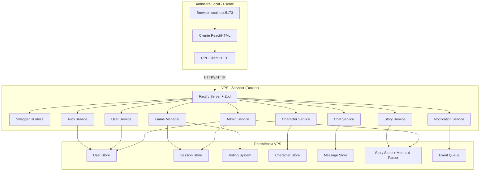

# 5. Arquitetura do Sistema

## 5.1 Visão Geral da Arquitetura Distribuída

O sistema utiliza arquitetura **cliente-servidor distribuída**:

- **Servidor**: Deployed em VPS rodando com Docker (ambiente containerizado)
- **Cliente**: Aplicação local baixada do GitHub que se conecta ao servidor remoto

## 5.2 Componentes Principais



## 5.3 Fluxo de Comunicação Distribuída

### Cliente Local (npm start)
1. **Setup**: `git clone` → `npm install` → `npm start`
2. **Execução**: Abre browser em `localhost:5173`
3. **Conectividade**: Cliente se conecta ao servidor VPS via HTTP/HTTPS
4. **Interface**: HTML/CSS/JS servindo interface local

### Servidor VPS (Docker)
1. **Deploy**: Container deployado na VPS
2. **Execução**: `docker run` mantém servidor isolado e rodando 24/7
3. **Endpoints**: RPC Server exposto via port mapping
4. **Domínio**: Acessível via IP público ou domínio

### Comunicação RPC Remota
- **Framework**: Fastify com `fastify-type-provider-zod`
- **Validação**: Schemas Zod para entrada/saída
- **Documentação**: Swagger UI em `/docs` (gerada automaticamente)
- **Protocolo**: JSON-RPC 2.0 over HTTP/HTTPS
- **CORS**: Configurado para aceitar requests do cliente
- **Autenticação**: JWT tokens para sessões
- **Long Polling**: Para atualizações em tempo real

### Stack de Autodocumentação
1. **Zod**: Define schemas de validação com `.describe()`
2. **fastify-type-provider-zod**: Conecta Zod ao Fastify
3. **@fastify/swagger**: Gera especificação OpenAPI dos schemas
4. **@fastify/swagger-ui**: Interface interativa em `/docs`

Benefícios:
- ✅ Validação automática de request/response
- ✅ Documentação sempre atualizada com o código
- ✅ Type-safety no TypeScript
- ✅ Interface interativa para testes
- ✅ Fonte única de verdade (schemas)

## 5.2 Estrutura de Dados Principais

### Usuário
```json
{
  "id": "user_123",
  "username": "jogador1",
  "passwordHash": "$2b$10$...",
  "role": "USER", // USER | ADMIN
  "createdAt": "2024-01-15T10:00:00Z",
  "lastLogin": "2024-01-15T15:30:00Z"
}
```

### Personagem D&D
```json
{
  "id": "char_456",
  "name": "Aragorn",
  "race": "Humano",
  "class": "Guerreiro",
  "background": "Soldado experiente que lutou em várias batalhas...",
  "appearance": "Alto, moreno, cicatriz no rosto, olhos determinados",
  "personality": "Corajoso, leal, protetor dos inocentes",
  "fears": "Perder companheiros em batalha",
  "goals": "Proteger o reino e encontrar seu lugar no mundo",
  "attributes": {
    "strength": 16,
    "dexterity": 13,
    "constitution": 15,
    "intelligence": 12,
    "wisdom": 14,
    "charisma": 11
  },
  "equipment": ["Espada longa", "Escudo", "Armadura de couro"],
  "userId": "user_123",
  "sessionId": "session_789",
  "isComplete": true,
  "createdAt": "2024-01-15T11:00:00Z",
  "updatedAt": "2024-01-15T11:30:00Z"
}
```

### História (convertida de Mermaid com Metadados)
```json
{
  "id": "historia-caverna",
  "title": "A Caverna Misteriosa",
  "description": "Uma aventura em uma caverna antiga",
  "genre": "Aventura",
  "synopsis": "Um grupo de aventureiros descobre uma caverna misteriosa que guarda segredos antigos. Suas escolhas determinarão se encontrarão tesouros ou perigos mortais.",
  "recommendedPlayers": {
    "min": 3,
    "max": 5,
    "optimal": 4
  },
  "estimatedDuration": "60-90 minutos",
  "difficulty": "Iniciante",
  "tags": ["Fantasia", "Exploração", "Mistério"],
  "createdBy": "admin_001",
  "mermaidSource": "flowchart TD\n  A[Início] --> B{Caverna?}...",
  "createdAt": "2024-01-10T09:00:00Z",
  "updatedAt": "2024-01-10T10:00:00Z",
  "isActive": true,
  "capitulos": {
    "inicio": {
      "texto": "Vocês chegaram à entrada de uma caverna misteriosa...",
      "opcoes": [
        {
          "id": "entrar",
          "texto": "Entrar na caverna",
          "proximo": "dentro-caverna"
        },
        {
          "id": "voltar",
          "texto": "Voltar para a cidade",
          "proximo": "cidade"
        }
      ]
    }
  }
}
```

### Sessão com Estados Expandidos
```json
{
  "id": "session_789",
  "name": "Aventura da Caverna - Grupo A",
  "sessionCode": "ABC123",
  "storyId": "historia-caverna",
  "ownerId": "user_123",
  "currentChapter": "inicio",
  "maxPlayers": 5,
  "participants": [
    {
      "userId": "user_123",
      "characterId": "char_456",
      "hasCreatedCharacter": true,
      "isOnline": true,
      "joinedAt": "2024-01-15T12:00:00Z"
    },
    {
      "userId": "user_124",
      "characterId": "char_457",
      "hasCreatedCharacter": false,
      "isOnline": true,
      "joinedAt": "2024-01-15T12:05:00Z"
    }
  ],
  "votes": {
    "char_456": "entrar",
    "char_457": null
  },
  "status": "CREATING_CHARACTERS", // WAITING_PLAYERS | CREATING_CHARACTERS | IN_PROGRESS | COMPLETED
  "isLocked": false,
  "originalParticipants": ["user_123", "user_124"],
  "createdAt": "2024-01-15T12:00:00Z",
  "updatedAt": "2024-01-15T12:30:00Z",
  "lastActivity": "2024-01-15T12:30:00Z",
  "startedAt": null,
  "completedAt": null
}
```

### Card de Sessão (Dashboard)
```json
{
  "sessionId": "session_789",
  "name": "Aventura da Caverna - Grupo A",
  "storyTitle": "A Caverna Misteriosa",
  "storyGenre": "Aventura",
  "status": "CREATING_CHARACTERS",
  "statusDisplay": "Criando personagens",
  "playerCount": {
    "current": 2,
    "max": 5
  },
  "progress": {
    "currentChapter": "inicio",
    "chapterTitle": "Entrada da Caverna"
  },
  "lastActivity": "2024-01-15T12:30:00Z",
  "timeAgo": "há 5 minutos",
  "canJoin": true,
  "sessionCode": "ABC123"
}
```

### Opções de Raça/Classe para Personagens
```json
{
  "races": [
    {
      "id": "human",
      "name": "Humano",
      "description": "Versáteis e adaptáveis",
      "traits": ["Versatilidade", "Determinação"]
    },
    {
      "id": "elf",
      "name": "Elfo",
      "description": "Graciosos e longevos",
      "traits": ["Agilidade", "Magia natural"]
    },
    {
      "id": "dwarf",
      "name": "Anão",
      "description": "Resistentes e corajosos",
      "traits": ["Resistência", "Artesanato"]
    },
    {
      "id": "halfling",
      "name": "Halfling",
      "description": "Pequenos mas corajosos",
      "traits": ["Sorte", "Furtividade"]
    }
  ],
  "classes": [
    {
      "id": "warrior",
      "name": "Guerreiro",
      "description": "Especialista em combate corpo a corpo",
      "primaryAttribute": "Força"
    },
    {
      "id": "mage",
      "name": "Mago",
      "description": "Manipulador de energias arcanas",
      "primaryAttribute": "Inteligência"
    },
    {
      "id": "rogue",
      "name": "Ladino",
      "description": "Especialista em furtividade e precisão",
      "primaryAttribute": "Destreza"
    },
    {
      "id": "cleric",
      "name": "Clérigo",
      "description": "Canal de poder divino",
      "primaryAttribute": "Sabedoria"
    }
  ]
}
```

### Estado da Sala de Espera
```json
{
  "sessionId": "session_789",
  "sessionCode": "ABC123",
  "sessionName": "Aventura da Caverna - Grupo A",
  "status": "CREATING_CHARACTERS",
  "canStart": false,
  "waitingFor": ["user_124"],
  "participants": [
    {
      "userId": "user_123",
      "username": "jogador1",
      "characterName": "Aragorn",
      "characterMiniDescription": "Guerreiro Humano, protetor dos inocentes",
      "hasCreatedCharacter": true,
      "isReady": true
    },
    {
      "userId": "user_124",
      "username": "jogador2",
      "characterName": null,
      "characterMiniDescription": null,
      "hasCreatedCharacter": false,
      "isReady": false
    }
  ],
  "story": {
    "title": "A Caverna Misteriosa",
    "genre": "Aventura",
    "estimatedDuration": "60-90 minutos"
  }
}
```

---

[← Anterior: Requisitos Não Funcionais](./04-requisitos-nao-funcionais.md) | [Voltar ao Menu](./README.md) | [Próximo: Fluxos →](./06-fluxos.md)