# 6. Fluxos do Sistema

## 6.1 Fluxo de Cadastro e Autenticação


## 6.2 Fluxo de Criação de Personagem e Sessão


## 6.3 Fluxo de Votação com Autenticação


## 6.4 Fluxo de Chat com Autenticação


## 6.5 Fluxo de Import de História Mermaid (Admin)


## 6.6 Fluxo de Gerenciamento Admin


## 6.7 Fluxo de Home Pós-Login


## 6.8 Fluxo de Criação de Sessão com Seleção de História


## 6.9 Fluxo de Criação de Personagens D&D


## 6.10 Fluxo da Sala de Espera e Validação


## 6.11 Fluxo de Entrada via Código de Sessão


## 6.12 Fluxo do Painel Administrativo


## 6.13 Fluxo de Visualização de Sessões por Usuário (Admin)


## 6.14 Fluxo de Exclusão com Confirmação (Admin)


## 6.15 Fluxo da Tela de Jogo com Timeline e Votação

```mermaid
sequenceDiagram
    participant C1 as Cliente 1
    participant C2 as Cliente 2
    participant S as Servidor RPC
    participant GS as Game Service
    participant VS as Voting System
    participant TS as Timer Service

    Note over C1,C2: Carregar tela de jogo
    C1->>S: RPC: getGameScreenState(sessionId, token)
    S->>GS: obterEstadoCompletoJogo(sessionId)
    GS->>S: {gameState, timeline, playerTiles, chatState}
    S->>C1: dados completos da tela

    C2->>S: RPC: getGameScreenState(sessionId, token)
    S->>C2: dados completos da tela

    Note over C1,C2: Timeline exibe capítulo atual
    S->>C1: {timeline: {currentEntry: {text: "Vocês chegam à caverna...", options: [...]}}}
    S->>C2: {timeline: {currentEntry: {text: "Vocês chegam à caverna...", options: [...]}}}

    Note over C1,S: Primeiro jogador vota - inicia timer
    C1->>S: RPC: vote(sessionId, characterId, "entrar", token)
    S->>VS: registrarVoto(sessionId, characterId, "entrar")
    S->>TS: iniciarTimer(sessionId, tempoLimite)
    S->>C1: {sucesso: true, timerStarted: true, timeRemaining: 60}

    Note over C1,C2: Polling para atualizações do jogo
    loop Polling contínuo
        C2->>S: RPC: checkGameUpdates(sessionId, lastUpdateId, token)
        S->>VS: verificarAtualizacoes(sessionId, lastUpdateId)
        S->>C2: {updates: [{type: "VOTE_RECEIVED", data: {characterName: "Aragorn", optionChosen: "entrar"}}], timerUpdate: {timeRemaining: 55}}

        C1->>S: RPC: checkGameUpdates(sessionId, lastUpdateId, token)
        S->>C1: {updates: [...], timerUpdate: {timeRemaining: 55}}
    end

    Note over C2,S: Segundo jogador vota
    C2->>S: RPC: vote(sessionId, characterId, "entrar", token)
    S->>VS: registrarVoto(sessionId, characterId, "entrar")
    S->>VS: verificarTodosVotaram(sessionId)
    VS->>VS: todos votaram, finalizar votação
    S->>C2: {sucesso: true}

    Note over S,TS: Finalizar votação por unanimidade
    S->>VS: finalizarVotacao(sessionId)
    VS->>VS: calcularVencedor("entrar": 2 votos)
    VS->>GS: avancarCapitulo(sessionId, "dentro-caverna")
    S->>TS: cancelarTimer(sessionId)

    Note over C1,C2: Notificar conclusão da votação
    C1->>S: RPC: checkGameUpdates(sessionId, lastUpdateId, token)
    S->>C1: {updates: [{type: "VOTING_COMPLETED", data: {result: {winningOption: "entrar", method: "UNANIMOUS"}}}]}

    C2->>S: RPC: checkGameUpdates(sessionId, lastUpdateId, token)
    S->>C2: {updates: [{type: "CHAPTER_CHANGED", data: {newChapter: {text: "Vocês entram na caverna escura..."}}}]}
```



## 6.16 Fluxo de Votação com Timeout Automático


## 6.17 Fluxo de Visualização de Ficha de Personagem


## 6.18 Fluxo de Inicialização de Combate e Rolagem de Iniciativa


## 6.19 Fluxo de Turnos de Ataque com Seleção de Alvos


## 6.20 Fluxo de Sistema de Ataque D20 vs CA com Críticos


## 6.21 Fluxo de Sistema de Morte e Ressurreição 2d10

```mermaid
sequenceDiagram
    participant C as Cliente (Morto)
    participant S as Servidor RPC
    participant CS as Combat Service
    participant DS as Dice Service

    Note over C,S: Personagem morre (HP ≤ 0)
    S->>CS: marcarComoMorto(characterId)
    CS->>CS: definirEstado(characterId, "DEAD")

    Note over C,S: Turno do personagem morto
    C->>S: RPC: getCombatState(sessionId, token)
    S->>CS: verificarEstadoPersonagem(characterId)
    S->>C: {currentTurn, canRevive: true, attemptsRemaining: 3}

    Note over C,S: Dialog de ressurreição aparece
    C->>S: RPC: attemptRevive(sessionId, characterId, token)
    S->>DS: rolar2D10()
    DS->>S: {dice1: 7, dice2: 4, results: [7, 4]}
    S->>CS: verificarRessurreicao(dice1, dice2)
    CS->>CS: dice1 !== dice2 → falha
    S->>C: {reviveResult: {success: false, attemptsRemaining: 2}, diceAnimation: {...}}

    Note over C,S: Segunda tentativa (próximo turno)
    C->>S: RPC: attemptRevive(sessionId, characterId, token)
    S->>DS: rolar2D10()
    DS->>S: {dice1: 6, dice2: 6, results: [6, 6]}
    S->>CS: verificarRessurreicao(dice1, dice2)
    CS->>CS: dice1 === dice2 → sucesso!
    CS->>CS: restaurarHP(characterId, percentual)
    CS->>CS: definirEstado(characterId, "ALIVE")
    S->>C: {reviveResult: {success: true, newHP: 15}, diceAnimation: {...}}

    Note over C,S: Personagem volta ao combate
    C->>S: RPC: checkCombatUpdates(sessionId, lastUpdateId, token)
    S->>C: {updates: [{type: "CHARACTER_REVIVED", data: {characterName, newHP}}]}

    Note over C,S: Cenário alternativo - 3 falhas
    alt Todas as 3 tentativas falharam
        S->>CS: marcarComoMortoPermanente(characterId)
        CS->>CS: definirEstado(characterId, "PERMANENTLY_DEAD")
        S->>C: {reviveResult: {isPermanentlyDead: true}, redirectTo: "spectatorMode"}
    end
```

## 6.22 Fluxo de Resolução de Combate com Recompensas

```mermaid
sequenceDiagram
    participant C1 as Cliente 1 (Vivo)
    participant C2 as Cliente 2 (Morto Permanente)
    participant S as Servidor RPC
    participant CS as Combat Service
    participant XS as XP Service

    Note over S,CS: Último inimigo é derrotado
    S->>CS: verificarCondicaoVitoria(sessionId)
    CS->>CS: todosInimigosEstaoMortos = true
    CS->>XS: calcularRecompensas(sessionId, sobreviventes)
    XS->>XS: calcularXP(inimigosVencidos, participantesVivos)
    XS->>XS: calcularRecuperacaoHP(sobreviventes)

    Note over S,CS: Finalizar combate
    S->>CS: finalizarCombate(sessionId)
    CS->>CS: compilarEstatisticas(participantes)
    CS->>S: {victory: true, rewards: {...}, stats: [...]}

    Note over C1,S: Dialog de vitória para sobreviventes
    C1->>S: RPC: checkCombatUpdates(sessionId, lastUpdateId, token)
    S->>C1: {updates: [{type: "COMBAT_ENDED", data: combatRewards}]}

    Note over C2,S: Notificação para mortos permanentes
    C2->>S: RPC: checkCombatUpdates(sessionId, lastUpdateId, token)
    S->>C2: {updates: [{type: "COMBAT_ENDED", data: spectatorResults}]}

    Note over C1,C2: Aplicar recompensas
    S->>CS: aplicarRecompensas(sobreviventes, rewards)
    CS->>CS: adicionarXP(characterIds, xpAmount)
    CS->>CS: recuperarHP(characterIds, hpAmount)

    Note over S: Retornar ao jogo normal
    S->>CS: retornarAoJogoNormal(sessionId)
    CS->>CS: limparEstadoCombate(sessionId)
    S->>C1: {redirectTo: "gameScreen", combatEnded: true}
    S->>C2: {redirectTo: "spectatorMode", combatEnded: true}
```

---

[← Anterior: Arquitetura](./05-arquitetura.md) | [Voltar ao Menu](./README.md) | [Próximo: APIs RPC →](./07-apis-rpc.md)